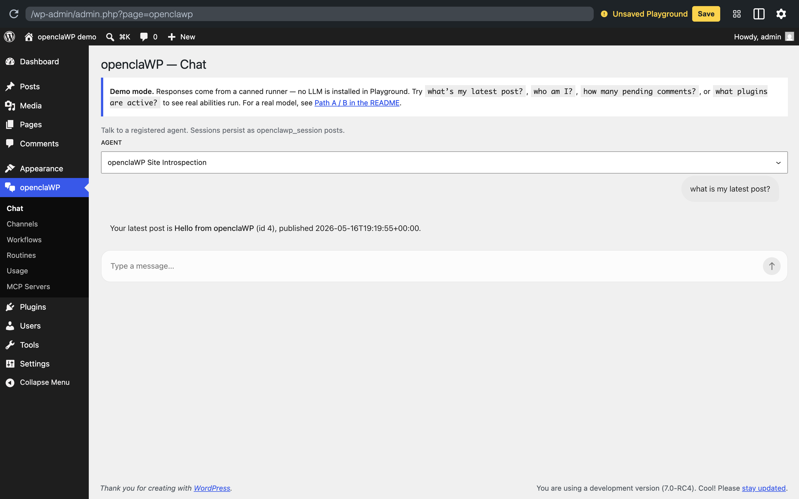

# openclaWP

[](https://playground.wordpress.net/?blueprint-url=https://raw.githubusercontent.com/lezama/openclawp/main/.wordpress-org/blueprints/blueprint.json)
[](LICENSE)
[](https://www.php.net/)
[](https://wordpress.org/)

**An agent that lives inside your WordPress site.** Reads your content, talks back through chat, and can be reached from outside WordPress through pluggable connectors.

Built on top of [`Automattic/agents-api`](https://github.com/Automattic/agents-api) and the AI Client / Connectors API bundled with WordPress 7.0. Other plugins register agents (with their own tools, system prompts, and personas); openclaWP turns the site itself into a place to *use* them.


*The bundled demo running entirely in your browser — no install, no API key. The agent calls the real `openclawp/get-recent-posts` ability and quotes the seeded post back.*

> ### ⚠️ Spike-stage software
>
> This is a research spike, not a product. Expect breakage. **Don't run it on a production site**, and ideally not on a computer or WhatsApp account you care about — it shells out to OS binaries, writes session data to disk, and pairs as a linked device on whichever WhatsApp account you sign in with. Use a throwaway / sandbox account when you can.

---

## What openclaWP does today

| Capability | What it means | Status |
|---|---|---|
| **Chat block** (`wp:openclawp/chat`) | Drop the agent UI into any post, page, template, or wp-admin screen | ✅ |
| **Chat ability** (`openclawp/chat`) | Callable from MCP servers, Studio Code skills, WP-CLI, other plugins — no HTTP needed | ✅ |
| **Canonical dispatcher** (`agents/chat`) | Per [agents-api#100](https://github.com/Automattic/agents-api/issues/100); the runtime-agnostic contract for "chat with an agent" | ✅ |
| **REST endpoints** | `POST /openclawp/v1/chat` for browser UIs, `GET /openclawp/v1/chat/{session}` for transcripts | ✅ |
| **Multi-turn sessions** | Each conversation is a CPT (`openclawp_session`); history follows the user across requests | ✅ |
| **Tool use** | Agents can call read-only abilities — recent posts, comment counts, active plugins, `who-am-I` — bundled with the example agent | ✅ |
| **Channels admin** | wp-admin Channels list view (`openclaWP → Channels`) for managing connectors per-site | ✅ |
| **Workflows** | Compose agents and abilities into deterministic recipes with `${inputs.x}` / `${steps.y.output.z}` bindings. CPT-backed Store + Run Recorder; runs hit `agents/run-workflow` (canonical dispatcher) and the openclaWP-shipped runtime persists every run for later inspection. wp-admin → openclaWP → Workflows lists registered workflows, has a **Run now** form per workflow, and a recent-runs list with per-step trace. Built on the [agents-api workflow substrate](https://github.com/Automattic/agents-api/pull/114). | ✅ |
| **Local-first inference** | Default Quick Start runs against [Ollama](https://ollama.com/) on `localhost`. No API key, no external service. Swap in Anthropic / OpenAI / Gemini when you want. | ✅ |
| **AI provider routing** | Per-agent provider + model selection via the standard WordPress AI client | ✅ |
| **Connector: WhatsApp via wacli** | Pair as a WhatsApp linked device using [`openclaw/wacli`](https://github.com/openclaw/wacli)'s whatsmeow protocol | ⚠️ unofficial |
| **Connector: WhatsApp Cloud API** | Meta's official Graph API, requires Business account + access token | ✅ alternative |
| **More connectors (Telegram, Slack, Email, …)** | The base class is in agents-api; build them like the wacli channel | ➖ not started |

---

## How openclaWP compares

The WordPress AI agent space has several plugins now. They overlap in the obvious places (chat in wp-admin, tool calling, multi-provider) but differ in how they sit relative to the new WordPress AI building blocks.

| | **openclaWP** | [sd-ai-agent](https://github.com/Ultimate-Multisite/superdav-ai-agent) | [ClawWP](https://github.com/hifriendbot/clawwp) | [AI Engine](https://github.com/jordymeow/ai-engine) | [AI Services](https://github.com/felixarntz/ai-services) | [WordPress/ai](https://github.com/WordPress/ai) |
|---|---|---|---|---|---|---|
| Substrate | `agents-api` + WP 7.0 AI Client | WP 7.0 AI Client | self | self | self | WP 7.0 AI Client + Abilities API |
| Provider | any [Connectors API](https://wordpress.org/plugins/ai-provider-for-openai/) plugin | any Connectors API plugin | Anthropic-first | OpenAI/Anthropic/Google | multi-provider | multi-provider |
| Per-agent MCP server | ✅ scoped to one agent's tools | via [WP MCP Adapter](https://github.com/WordPress/mcp-adapter) (site-wide) | — | ✅ site-wide | via WP MCP Adapter | — |
| MCP client | — | — | ✅ HTTP+stdio | ✅ | — | — |
| Workflows | ✅ deterministic, CPT-backed, run recorder | — | — | — | — | (on roadmap) |
| Per-turn cost dashboard | ✅ | — (tracks tokens) | ✅ | — | — | (on roadmap) |
| WordPress Playground demo | ✅ | ✅ | — | — | ✅ | ✅ |
| Chat block (Gutenberg) | ✅ | three chat UIs | sidebar | UI Builder | — | (Gutenberg blocks) |
| Concrete channel connectors | WhatsApp Cloud API | — | Telegram / Slack / Discord | — | — | — |

**Where openclaWP fits:** if you're already using (or planning to use) the `agents-api` substrate or the WordPress AI Client, openclaWP is the thinnest consumer that gives you a chat UI, REST surface, workflows, and an MCP endpoint. If you want a closed, "install one plugin and you're done" experience, sd-ai-agent or AI Engine are heavier-but-more-batteries-included.

---

## Quick start

The default path is the [Studio Mac app](https://developer.wordpress.com/studio/) for the WordPress side, and [Ollama](https://ollama.com/) for the model. Both run locally — no Docker, no API keys, no external service. Once you can talk to the agent in **wp-admin → openclaWP → Chat**, swap in a cloud provider or wire up a connector when the spike calls for it.

If you're an LLM coding agent (Claude / Codex / …): each shell block below is self-contained. Pick the path that matches the user's environment and run it. No human-in-the-loop steps unless explicitly noted.

### Path A — Studio + local Ollama (default)

Requires the Studio app and its [CLI](https://developer.wordpress.com/studio/cli/) (`studio` on PATH), plus [Ollama](https://ollama.com/) running locally. macOS.

```bash
# 1. Local model. gemma4:e2b is the smallest Gemma with native function
#    calling — the bundled openclawp-example agent calls tools to read
#    posts / count comments / list plugins, so you need tool support
#    or those questions get hand-wavy guesses. Bigger picks for better
#    quality: gemma4:e4b (9.6 GB), gemma4:26b (18 GB). Sizing guide:
#    docs/local-ollama.md.
#
#    Not sure what fits? `llmfit` (https://github.com/AlexsJones/llmfit)
#    scans your CPU / RAM / GPU and scores ~150 models for fit + speed +
#    quality across providers — a faster way to pick than trial-and-error.
ollama serve >/dev/null 2>&1 &     # no-op if already running
ollama pull gemma4:e2b

# 2. WordPress site
studio site create \
	--name openclawp-demo \
	--wp latest --php 8.4 \
	--skip-browser
SITE_PATH="$HOME/Studio/openclawp-demo"

# 3. Drop in the plugins (openclawp + agents-api substrate + Ollama provider)
mkdir -p "$SITE_PATH/wp-content/plugins"
cd "$SITE_PATH/wp-content/plugins"
git clone https://github.com/Automattic/agents-api.git
git clone https://github.com/lezama/openclawp.git
git clone https://github.com/Fueled/ai-provider-for-ollama.git
( cd openclawp && composer install --no-dev )
( cd ai-provider-for-ollama && composer install --no-dev )

# 4. Activate + point WP at the local Ollama daemon
studio --path "$SITE_PATH" wp plugin activate \
	agents-api openclawp ai-provider-for-ollama
studio --path "$SITE_PATH" wp option update \
	ai_provider_for_ollama_settings \
	'{"host":"http://localhost:11434","model":"gemma4:e2b"}' \
	--format=json
```

Visit **wp-admin → openclaWP → Chat**. Try a tool-using prompt to confirm the wiring — *"what's my latest post?"* should make the agent call the `get-recent-posts` tool and quote the title back. *"who am I?"* exercises `get-current-user`. *"how many pending comments?"* exercises `count-comments`. If the answers are vague hand-waves, the model isn't actually invoking tools — bump up to `gemma4:e4b` or check that the Ollama provider is the active one (`wp eval 'print_r(WordPress\AiClient\AiClient::defaultRegistry()->getRegisteredProviderIds());'`).

> First reply takes 10–30s while Ollama loads the model into RAM; subsequent turns are interactive. Full Ollama runbook (sizing, troubleshooting, rollback): [`docs/local-ollama.md`](docs/local-ollama.md).

#### Prefer a cloud provider?

Skip step 1 and the Ollama clone in step 3. After step 4 (activating openclawp), drop in any `WordPress/ai-provider-for-*` plugin and configure its key via *Settings → Connectors* in wp-admin, or directly:

```bash
studio --path "$SITE_PATH" wp option update \
	connectors_ai_anthropic_api_key "$ANTHROPIC_API_KEY"
```

### Path B — an existing WordPress site

If a site already exists (Pressable, a VPS, [Local](https://localwp.com/), your own Docker, …), drop the plugins in. Anthropic shown to keep the block short — the Ollama recipe in Path A applies verbatim, just call `wp` instead of `studio --path … wp`.

```bash
# Inside any site's plugins directory:
git clone https://github.com/Automattic/agents-api.git
git clone https://github.com/lezama/openclawp.git
( cd openclawp && composer install --no-dev )
wp plugin activate agents-api openclawp
wp option update connectors_ai_anthropic_api_key "$ANTHROPIC_API_KEY"
```

(Same caveat as above: don't aim this at a real production site yet.)

---

## Register an agent

Agent registration is **not** an openclaWP API. It's the substrate's API — `Automattic/agents-api` — so any plugin or mu-plugin can register an agent and every consumer (openclaWP, Data Machine, future others) picks it up.

```php
add_action( 'wp_agents_api_init', function () {
    wp_register_agent( 'my-agent', array(
        'label'          => __( 'My Agent', 'my-plugin' ),
        'description'    => 'You are a helpful assistant. Be concise.',
        'default_config' => array(
            'provider' => 'auto',
            'model'    => 'claude-haiku-4-5',
        ),
    ) );
} );
```

For a working tool-using example, set `add_filter( 'openclawp_register_example_agent', '__return_true' )` and the bundled `openclawp-example` agent registers itself with four read-only abilities (`get-recent-posts`, `count-comments`, `get-active-plugins`, `get-current-user`).

---

## Surfaces

The agent loop is the same regardless of surface; pick whichever fits the caller.

| Surface | What to use it for |
|---|---|
| `<!-- wp:openclawp/chat /-->` block | Embedding chat in a post / template / wp-admin screen |
| `wp_get_ability( 'openclawp/chat' )->execute( … )` | MCP servers, Studio Code skills, WP-CLI, other plugins |
| `wp_get_ability( 'agents/chat' )->execute( … )` | Same as above, but via the runtime-agnostic dispatcher (preferred for cross-consumer code) |
| `wp_get_ability( 'agents/run-workflow' )->execute( … )` | Run a registered workflow (id) or an inline spec; openclaWP persists the run via the bundled CPT recorder |
| `wp_get_ability( 'agents/validate-workflow' )->execute( … )` | Lint a workflow spec; pure substrate, no runtime touch |
| `POST /openclawp/v1/chat` | Browser-driven UIs |
| Channels (e.g., WhatsApp) | Reaching the agent from outside WordPress entirely |

REST chat routes default to `manage_options`; gate with `openclawp_rest_permission_callback`. Channel webhooks are HMAC-gated.

---

## Connectors / Channels

Channels live at **wp-admin → openclaWP → Channels**. Each one is a small adapter that subclasses `\AgentsAPI\AI\Channels\WP_Agent_Channel` — extract the inbound message, validate it, hand it to `agents/chat`, deliver the reply. New channels (Telegram, Slack, Email, …) implement the same five hooks.

Today, two WhatsApp transports ship. Both are off by default; opt in to the one that matches your account type.

### WhatsApp Cloud API (Meta — official)

Use this when you have or want a real WhatsApp Business account, a verified phone number ID, and a permanent access token — the standard path for production-grade business deployments.

Opt in: `add_filter( 'openclawp_register_whatsapp', '__return_true' );`. Configure credentials at **wp-admin → openclaWP → WhatsApp**, point Meta's webhook at `/openclawp/v1/whatsapp/webhook`. Inbound text is signature-verified (`X-Hub-Signature-256`), dispatched to the configured agent, and the reply is posted back via the Graph API.

Full Meta-side runbook: [`docs/whatsapp-setup.md`](docs/whatsapp-setup.md).

### WhatsApp via `wacli` (unofficial — research only)

This is the experimental path. It pairs the site as a *linked device* on a normal WhatsApp account using [`openclaw/wacli`](https://github.com/openclaw/wacli)'s whatsmeow-based protocol — no Meta Business account, no Cloud API, no permanent access token. **It is not sanctioned by Meta** and your account could be flagged or banned for using it. Don't pair an account you can't afford to lose.

WhatsApp pairing needs `proc_open` to spawn the wacli binary, which means real Linux PHP. Studio's PHP-WASM sandbox can't run host binaries, so for this connector use the bundled wp-env stack:

```bash
git clone https://github.com/Automattic/agents-api.git
git clone https://github.com/lezama/openclawp.git
cd openclawp/tools/wp-env
npm install && npm start

# Provider — Anthropic shown for brevity. Ollama works too: clone
# Fueled/ai-provider-for-ollama into the wp-env's plugins dir, activate
# it, and set host to "http://host.docker.internal:11434" so the container
# reaches the host's Ollama daemon.
npx wp-env run cli wp option update \
	connectors_ai_anthropic_api_key "$ANTHROPIC_API_KEY"

# Test mode: the agent ONLY responds in your "Message yourself" chat.
# Anything you type to family / coworkers / groups is silent-skipped.
# Set this when pairing a personal account — see the Self-message modes
# section below for the full set of options.
npx wp-env run cli wp option update openclawp_wacli_self_message_mode only
```

Then `http://localhost:8888/wp-admin/admin.php?page=openclawp-channels&channel=wacli`, click **Connect WhatsApp**, scan the QR.

| Option | What it controls | Default |
|---|---|---|
| `openclawp_wacli_agent` | Slug of the agent that receives messages. Required. | `''` |
| `openclawp_wacli_secret` | HMAC-SHA256 secret for inbound webhook. Auto-generated. | auto |
| `openclawp_wacli_binary` | Path to the `wacli` executable. | resolved from PATH / Homebrew |
| `openclawp_wacli_allowed_jids` | Comma-separated JID allowlist. Empty = allow every chat. | `''` |
| `openclawp_wacli_self_message_mode` | One of `block` / `allow` / `only`. Surfaced as a dropdown in the admin. | `block` |
| `openclawp_wacli_workflow_id` | Route inbound WhatsApp messages to this workflow id instead of the configured agent. The workflow receives `text` / `chat_jid` / `sender_jid` / `push_name` / `room_kind` as inputs; its last step's `reply` / `message` / `text` / `value` field becomes the WhatsApp reply. Empty = chat-with-agent (default). | `''` |

#### Self-message modes

The bot is paired as a *linked device* on a real WhatsApp account, so what counts as "addressed to the agent" matters:

| Mode | What reaches the agent | What's silent-skipped | When to use |
|---|---|---|---|
| `block` (default) | every message from other contacts | every message you send | Production / shared bot account |
| `allow` | every message, regardless of sender | nothing (only the outbound `msg_id` echo) | Dedicated bot account, no humans on it |
| `only` | only messages you send in your own *Message yourself* chat (sender == recipient == you) | DMs to other contacts, group chats, messages from others | Solo testing on a personal account — the safest demo loop |

Loop prevention runs in every mode: each outbound `msg_id` lives in a 5-minute transient, so wacli's reflection of the bot's own replies never re-triggers the agent.

Full troubleshooting + advanced flags: [`tools/wp-env/README.md`](tools/wp-env/README.md).

---

## Filters reference

| Filter | What it changes |
|---|---|
| `openclawp_register_example_agent` | Register the bundled `openclawp-example` agent. Default `false`. |
| `openclawp_register_whatsapp` | Register the WhatsApp Cloud API ingress. Default `false`. |
| `openclawp_conversation_store` | Swap the default CPT-backed store for another `WP_Agent_Conversation_Store` impl. |
| `openclawp_turn_runner_factory` | Replace the wp-ai-client turn runner with a custom one. |
| `openclawp_rest_permission_callback` | Override the default `manage_options` REST gate. |
| `openclawp_chat_ability_permission` | Override the default `manage_options` gate on `openclawp/chat`. |
| `openclawp_wacli_skip_self_messages` | Per-request override of the from_me skip in the wacli channel. |
| `openclawp_wacli_binary_candidates` | Add custom paths to wacli auto-discovery. |
| `openclawp_channels` | Register additional Channels in the wp-admin Channels list view. |

`openclawp_chat_turn_completed` fires after every chat turn with provider, model, token usage, and wall duration — grep `error_log` for `[openclawp] chat_turn=…`.

---

## Testing

```bash
composer install
vendor/bin/phpunit                                     # 41 unit tests
```

Plus a smoke test that needs a running WP (any of the install paths above):

```bash
wp eval-file tests/smoke.php   # or studio --path … wp eval-file
```

End-to-end (REST → ability → `proc_open` → real WhatsApp) is exercised manually in the wp-env stack — it depends on a paired account.

---

## Documentation

- [`tools/wp-env/README.md`](tools/wp-env/README.md) — wp-env scaffold troubleshooting + advanced flags
- [`docs/whatsapp-setup.md`](docs/whatsapp-setup.md) — Meta-side runbook for the official Cloud API channel
- [`docs/local-ollama.md`](docs/local-ollama.md) — agent runbook for routing chat to a local Gemma via Ollama
- [`docs/provider-precedence.md`](docs/provider-precedence.md) — recorded design for per-agent / per-site provider routing

---

## Source provenance

Lifts load-bearing primitives from [Extra-Chill/data-machine](https://github.com/Extra-Chill/data-machine) (Chris Huber's flagship agents-api consumer): composer dep + bootstrap guard, `wp_agents_api_init` registration, lock-aware conversation store, wp-abilities-API for tools, `wp_ai_client_prompt()` turn runner. openclaWP trades DM's pipelines / flows / jobs surface for the smallest possible agent surface.

## License

GPL-2.0-or-later.
